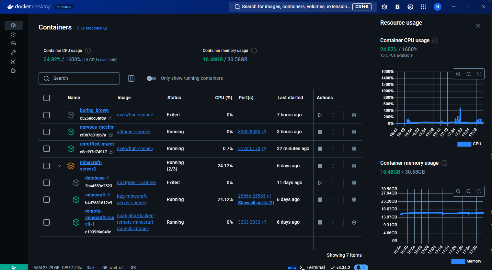
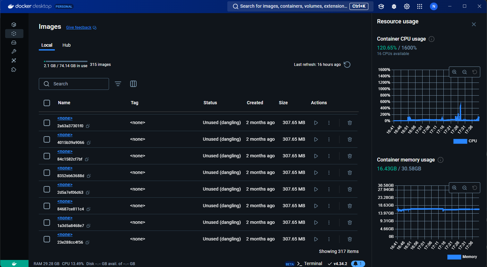
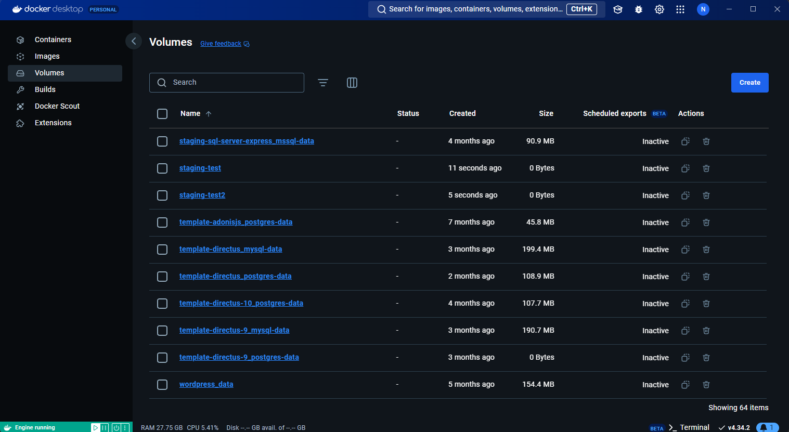

# Docker Desktop

Docker Desktop provides a nice interface for local development. You can easily see what containers are running, view logs and stats about the containers, stop and remove containers, execute commands and even view the file system of the container.

> Personally, I find myself sticking to the command line with Docker, but it's still nice to have.

## Container management

## Image management

TODO: discuss more about how I used images here

## Volume management

## Additional tools

Docker Desktop is constantly being updated as well, providing developers with new tools that can be utilized
